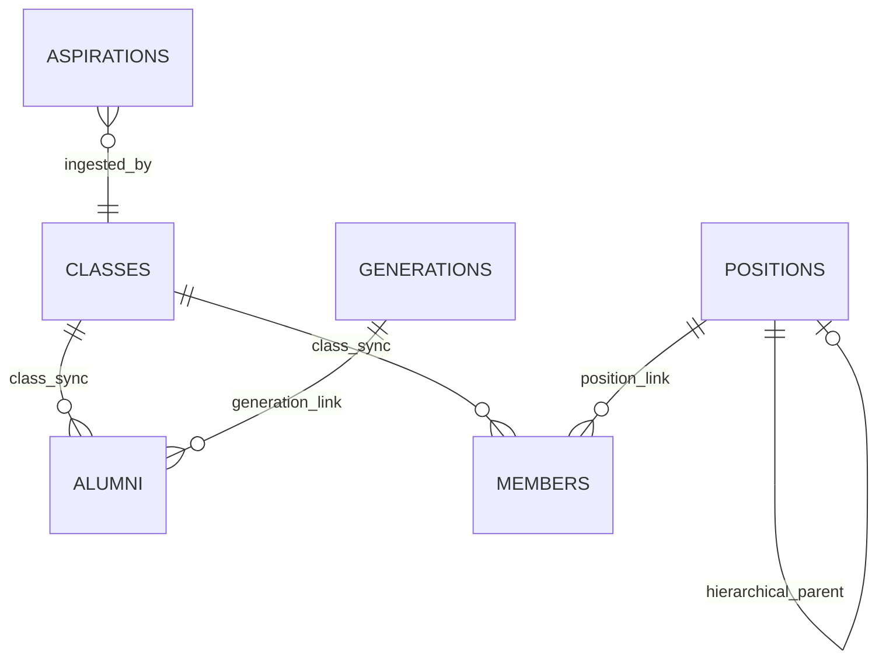
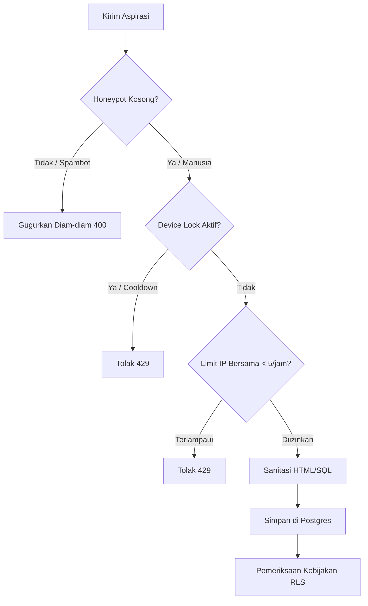

<div align="center">
  <br />
  <a href="https://github.com/Riz6ix/MPK">
    
  </a>
  <br />
  <br />

  <h1 align="center">🌲 Website Majelis Perwakilan Kelas SMA 🍂</h1>

  <p align="center">
    <strong>Portal tata kelola premium, cozy, dan berkinerja tinggi untuk SMAN 1 Malingping.</strong>
    <br />
    <em>Dirancang dengan estetika hangat yang presisi, arsitektur node relasional yang kokoh, dan standar keamanan elit.</em>
    <br />
    <br />
    <a href="https://astro.build"></a>
    <a href="https://reactjs.org/"></a>
    <a href="https://supabase.com"></a>
    <a href="https://tailwindcss.com/"></a>
  </p>
</div>

<p align="center">
  <kbd> <a href="README.md">🌐 English</a> </kbd> • <kbd> <a href="README.id.md">🇮🇩 Bahasa Indonesia</a> </kbd>
</p>

---

## ✦ Visi Proyek & Sentuhan Cozy

Organisasi siswa sering kali terjebak dalam alur kerja yang terfragmentasi—tabel spreadsheet yang terpisah-pisah, kotak saran fisik yang berdebu, dan saluran informasi yang mudah terputus. Sistem ini merekayasa ulang tata kelola **Majelis Perwakilan Kelas (MPK)** menjadi satu rumah digital yang terintegrasi indah dan terpusat.

### 🍃 Estetika Premium
- **Palet Harmonis**: Dibangun di sekitar tema forest-green yang cozy (`#2e473b`, warna HSL terkurasi) dipadukan dengan latar belakang cream hangat serta kartu transisi yang lembut.
- **Animasi Organik**: Animasi mikro bawaan untuk keadaan perkecil/perbesar (expand/minimize), panel akordion, dan tabel untuk memberikan sensasi mengalir yang menyatu tanpa lag atau pergeseran tata letak (layout shift).
- **Minecraft Cozy Particle Dust**: Efek partikel halus yang bereaksi anggun, menciptakan suasana tenang kelas atas layaknya "nature-office" yang nyaman.
- **Tanpa Elemen Default**: Tipografi bersih menggunakan Google Fonts (Outfit, Inter) dan elemen formulir modern yang dikustomisasi secara menyeluruh.

---

## ✦ Arsitektur Node Jaring Laba-Laba

Aplikasi ini dibangun di atas **model relasional yang sepenuhnya tersinkronisasi**. Setiap titik data bertindak sebagai simpul (node) yang saling terhubung, memperbarui secara real-time untuk menghindari desinkronisasi manual.



- **Kelas (`classes`)**: Bertindak sebagai direktori utama kelas sekolah. Pengurus aktif dan alumni terikat secara relasional pada lookup ini, mengubah input teks manual menjadi dropdown dinamis yang bebas dari kesalahan.
- **Struktur Jabatan (`positions`)**: Pohon hierarkis self-referential untuk mengonfigurasi hubungan rantai komando pengurus secara dinamis.
- **Angkatan (`generations`)**: Periode sejarah kepengurusan yang memetakan masa bakti aktif ke tahun kelulusan tertentu.

---

## ✦ Alat Administratif Pintar

### ⚡ Smart Batch Import ("Tempel List")
Administrator dapat menyalin-tempel daftar mentah siswa secara langsung ke panel admin.
1. **Auto-Guess Parsing**: Membaca nama, menebak kelas, komisi kepengurusan, dan jenis kelamin secara cerdas.
2. **Seed-Based Avatar**: Memetakan setiap hasil impor ke avatar DiceBear unik yang dihasilkan dari inisial nama.
3. **Bulk Insertion**: Menyusun payload dan menyimpannya dalam satu batch query Supabase demi efisiensi optimal.

### 🛡️ Kebijakan Eksklusivitas Jabatan Developer
Untuk menghormati asal-usul platform, jabatan **"Developer"** dikunci secara mutlak pada tingkat kode dan logika aplikasi.
- **Validasi Ketat**: Upaya menambahkan atau memperbarui data pengurus/alumni dengan jabatan `"Developer"` akan ditolak secara otomatis kecuali nama yang dimasukkan adalah `"Rizky Setiawan"` (Angkatan Primordial).

---

## ✦ Kerangka Keamanan Tingkat Elit

Mengamankan situs administratif siswa membutuhkan kerangka kerja praktis dan kokoh yang mencegah keisengan lokal (local griefing) tanpa menghalangi penggunaan nyata di sekolah.



### 1. Hybrid Rate Limiting (Aman untuk Wi-Fi Sekolah)
Pembatasan murni berbasis IP selama 1 jam akan memblokir seluruh siswa ketika mereka mengirim aspirasi dari jaringan Wi-Fi sekolah yang sama. Kami menerapkan **Hybrid Security Pipeline**:
*   **Local Device Lock**: Mengunci pengiriman berulang selama 1 jam via Local Storage terenkripsi di browser pengguna.
*   **Relaxed Server IP Window**: Server melonggarkan batas hingga `5 pengiriman per jam` per IP, melindungi endpoint dari keisengan massal tetapi tetap ramah bagi jaringan Wi-Fi bersama sekolah.

### 2. Pertahanan Anti-Spam & Injeksi
*   **Honeypot Traps**: Kolom input tidak terlihat yang menjebak bot otomatis. Pengiriman yang mengisi honeypot akan digugurkan secara diam-diam.
*   **Sanitasi Ketat**: Setiap teks input melalui validasi Unicode dan escaping entitas HTML untuk menetralkan celah XSS.

### 3. PostgreSQL Row-Level Security (RLS) Mutlak
Database menerapkan kebijakan RLS ketat di seluruh tabel untuk mencegah manipulasi data langsung dari klien API ilegal.

| Tabel | Akses Publik | Akses Admin Terotentikasi | Aturan RLS (SQL) |
| :--- | :--- | :--- | :--- |
| `classes` | SELECT | ALL (Insert, Update, Delete) | `auth.role() = 'authenticated'` |
| `members` | SELECT | ALL (Insert, Update, Delete) | `auth.role() = 'authenticated'` |
| `alumni` | SELECT | ALL (Insert, Update, Delete) | `auth.role() = 'authenticated'` |
| `positions` | SELECT | ALL (Insert, Update, Delete) | `auth.role() = 'authenticated'` |
| `generations`| SELECT | ALL (Insert, Update, Delete) | `auth.role() = 'authenticated'` |
| `memos` | SELECT | ALL (Insert, Update, Delete) | `auth.role() = 'authenticated'` |
| `aspirations`| SELECT, INSERT| ALL (Update, Delete) | Public `INSERT` / Admin `ALL` |

---

## ✦ Panduan Setup Developer

Ikuti langkah berikut untuk menjalankan workspace lokal.

### 1. Kebutuhan Sistem
- **Node.js**: `v22.12.0` atau lebih baru
- **Package Manager**: `npm` (v10+)
- **Database**: PostgreSQL (Proyek Supabase aktif)

### 2. Instalasi
Klon repositori dan pasang dependensi proyek:
```bash
git clone https://github.com/Riz6ix/MPK.git
cd MPK
npm install
```

### 3. Variabel Lingkungan (Environment Variables)
Buat file `.env` di root proyek untuk menyimpan string koneksi API:
```env
# Kunci Publik Supabase
PUBLIC_SUPABASE_URL="https://ujmpdahlbalttdtkzyax.supabase.co"
PUBLIC_SUPABASE_ANON_KEY="kunci-anon-anda-di-sini"

# Webhooks (Opsional)
DISCORD_WEBHOOK_URL="https://discord.com/api/webhooks/..."
```

### 4. Setup Database
Terapkan migrasi di folder `/supabase/migrations` untuk menyelaraskan skema database Anda:
1. `20260526000000_create_classes_table.sql` - Inisialisasi struktur kelas dan data benih awal.
2. `20260526000001_secure_other_tables.sql` - Menerapkan aturan RLS ketat dan trigger otomatis.

### 5. Menjalankan Server Lokal
Jalankan dev server dengan fitur hot-reloading:
```bash
npm run dev
```
Situs akan berjalan di [http://localhost:4321](http://localhost:4321).

---

## ✦ Infrastruktur Deployment

Website ini dikonfigurasi untuk **Server-Side Rendering (SSR)** di **Netlify** menggunakan `@astrojs/netlify`.
*   **CD Pipeline**: Setiap push ke branch `main` di GitHub akan memicu build otomatis di Netlify.
*   **Build Script**: `npm run build` menghasilkan serverless functions dan kompilasi static pages berkinerja tinggi.
*   **Cache Management**: Penyajian aset server-side yang cepat dengan waktu respon di bawah satu detik.

---
<div align="center">
  <sub>Developed with sustainable dedication by <strong>Angkatan Primordial</strong>. All Rights Reserved.</sub>
</div>