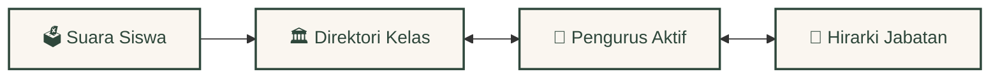
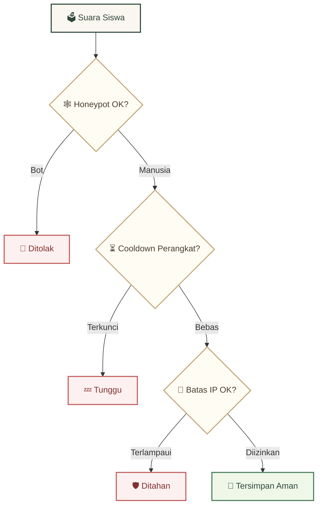

<div align="center">
  <br />
  <a href="https://github.com/Riz6ix/MPK">
    
  </a>
  <br />
  <br />

  <h1>🍂 MAJELIS PERWAKILAN KELAS 🍃</h1>
  <p><sub>SMA Negeri 1 Malingping</sub></p>

  <p>
    <strong>Website portal kesiswaan yang sederhana, nyaman di mata, dan berkeamanan tinggi.</strong>
    <br />
    <em>Navigasi bersahabat · kueri database cepat · perlindungan privasi yang ketat</em>
  </p>

  <p>
    <a href="https://astro.build"></a>
    <a href="https://reactjs.org/"></a>
    <a href="https://supabase.com"></a>
    <a href="https://tailwindcss.com/"></a>
  </p>

  <p>
    <kbd> <a href="README.md">🌐 English</a> </kbd> • <kbd> <a href="README.id.md">🇮🇩 Bahasa Indonesia</a> </kbd>
  </p>
</div>

---

### ✦ 🍃 Desain *Cozy* & Hangat

*Tampilan visual yang ramah dan nyaman untuk interaksi warga sekolah:*

- 🌿 **Warna Alami** — Kombinasi hijau hutan lembut, aksen emas hangat, dan latar belakang kertas perkamen
- 🍂 **Transisi Mulus** — Animasi natural pada panel akordion dan dropdown yang terasa bersahabat di mata
- ✨ **Debu Emas Melayang** — Partikel piksel emas khas Minecraft yang bergerak tenang di latar belakang

---

### ✦ 🕸️ Alur Relasi Data (*Database*)

*Semua data kesiswaan mengalir lancar melalui relasi database yang terstruktur:*



- 🌱 **Pengelompokan Otomatis** — Aspirasi yang masuk otomatis dikelompokkan berdasarkan kelas pelapor secara seketika (*real-time*)
- 📜 **Daftar Purna Bakti** — Data alumni dan pengurus masa bakti terdahulu tersimpan aman di tabel terpisah

---

### ✦ ⚡ Fitur Cerdas Admin

*Alat administratif praktis untuk menyederhanakan tugas pengurus MPK:*

- 📋 **Impor Daftar Cepat** — Tinggal tempel daftar nama; sistem otomatis membaca kelas, komisi, gender, dan membuat avatar Dicebear
- 🔏 **Kunci Pengembang** — Aturan database mengunci peran `"Developer"` secara eksklusif hanya untuk **Rizky Setiawan**
- 📎 **Memo & Nasihat** — Papan catatan tempel interaktif dan widget kata bijak kepemimpinan harian

---

### ✦ 🛡️ Sistem Keamanan & Privasi

*Menjamin suara siswa terkirim dengan aman melalui perlindungan *backend* berlapis:*



- 🕷️ **Jebakan *Honeypot*** — Input tersembunyi yang mendeteksi dan membuang bot spam secara senyap
- ⏱️ **Batas Frekuensi** — Pembatasan jumlah kiriman (*rate limit*) per jam dan waktu jeda (*cooldown*) perangkat untuk mencegah database macet
- 🧱 **PostgreSQL RLS** — Kebijakan *Row-Level Security* aktif penuh di semua tabel database utama

---

### 🚀 Panduan *Setup* Lokal

```bash
# Klon dan pasang dependensi
git clone https://github.com/Riz6ix/MPK.git && cd MPK && npm install

# Masukkan kredensial proyek ke .env
echo 'PUBLIC_SUPABASE_URL="https://proyek-anda.supabase.co"
PUBLIC_SUPABASE_ANON_KEY="kunci-anon-anda"' > .env

# Jalankan server lokal
npm run dev
```
> Buka [http://localhost:4321](http://localhost:4321) · membutuhkan akun & kredensial Supabase

---
<div align="center">
  <sub>Dikembangkan dengan dedikasi oleh <strong>Angkatan Primordial</strong> · SMAN 1 Malingping</sub>
</div>