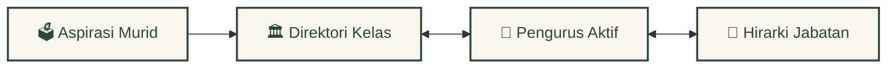
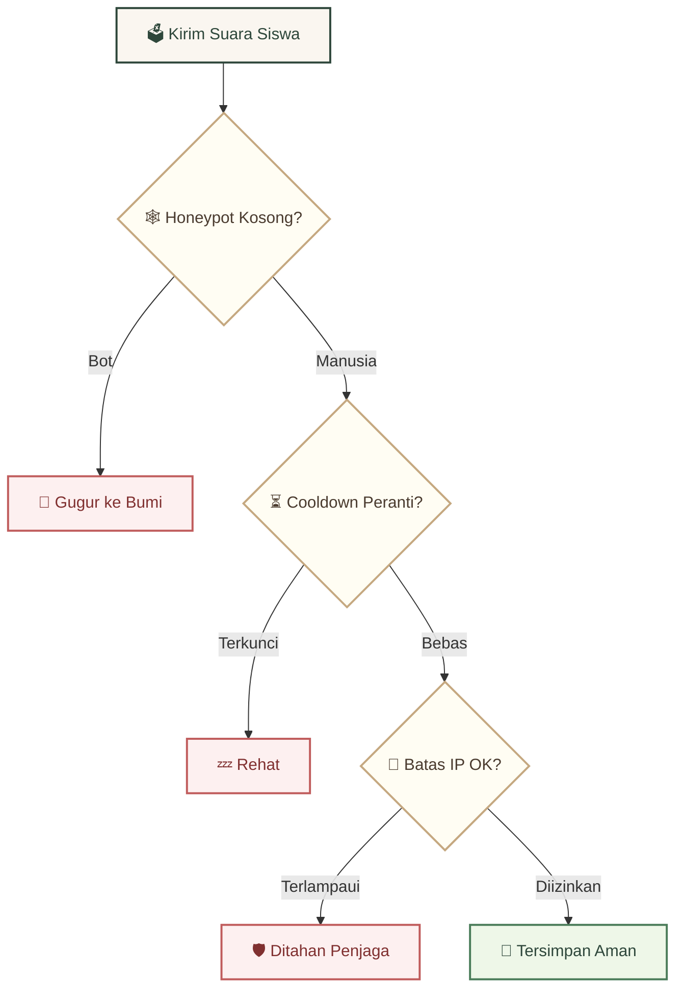

<div align="center">
  <br />
  <a href="https://github.com/Riz6ix/MPK">
    
  </a>
  <br />
  <br />

  <h1>🌲 Majelis Perwakilan Kelas 🍂</h1>
  <p>🏛️ <em>SMA Negeri 1 Malingping</em></p>

  <p>
    <strong>Sebuah tempat bernaung bagi tata kelola kesiswaan, dirancang dengan estetika hutan yang hangat dan performa rekayasa tinggi.</strong>
    <br />
    <em>Akar jalinan relasi yang saling berbisik, respon kueri sub-milidetik, dan perlindungan privasi yang kokoh.</em>
  </p>

  <p>
    <a href="https://astro.build"></a>
    <a href="https://reactjs.org/"></a>
    <a href="https://supabase.com"></a>
    <a href="https://tailwindcss.com/"></a>
  </p>

  <p>
    <kbd> <a href="README.md">🌐 English</a> </kbd> • <kbd> <a href="README.id.md">🇮🇩 Bahasa Indonesia</a> </kbd>
  </p>
</div>

---

### ✦ 🍃 Estetika Forest Academy & Kertas Perkamen

Didesain dengan psikologi tata letak untuk kenyamanan mata dan keaslian interaksi pengguna:
*   **Warm Forest Canvas**: Kombinasi warna forest green pekat (`#2e473b`), aksen emas amber, dan latar kertas perkamen yang hangat untuk menenangkan mata.
*   **Transisi Daun Mengalir**: Transisi panel akordion tanpa jeda dan dropdown dinamis yang terasa selembut desiran daun tertiup angin.
*   **Minecraft Suspended Dust**: Partikel debu emas mengambang secara tenang di latar belakang, terinspirasi oleh partikel atmosferik hangat Minecraft yang bereaksi lembut.

---

### ✦ 🕸️ Jalinan Akar Relasi Kesiswaan (100% Sinkron)



*   **Sinkronisasi Akar Dinamis**: Layaknya jalinan akar pohon yang saling terhubung, aspirasi siswa secara dinamis masuk ke dalam direktori kelas utama, terikat langsung pada daftar perwakilan kelas aktif, dan terurut secara real-time.
*   **Arsip Kuno Angkatan**: Riwayat alumni dan masa bakti pengurus terdahulu disimpan dengan aman pada simpul relasional terpisah guna menjaga warisan sejarah sekolah.

---

### ✦ ⚡ Meja Ek Tua & Alat Administratif Cerdas

*   **Smart Quill Batch Import**: Salin dan tempel daftar mentah siswa. Sistem secara cerdas mengurai kelas, komisi, gender, serta langsung menyematkan avatar Dicebear yang elegan.
*   **Segel Kerajaan (Kunci Developer)**: Batasan ketat di tingkat database yang mengunci peran `"Developer"` secara eksklusif hanya untuk **Rizky Setiawan** (Angkatan Primordial).
*   **Memo Perkamen & Catatan Harian**: Catatan local storage interaktif dan widget kutipan kepemimpinan harian untuk memandu tugas administratif harian.

---

### ✦ 🛡️ Penjaga Pohon Ek (Benteng Keamanan & Proteksi Privasi)



*   **Batasan Laju Penjaga (Rate Limiting)**: Ramah terhadap Wi-Fi bersama sekolah (toleransi 5 pengiriman/jam per IP) dipadukan dengan jeda penguncian perangkat Local Storage selama 1 jam untuk mencegah spam.
*   **Jebakan Honeypot**: Bidang formulir tersembunyi yang berfungsi sebagai jaring laba-laba, secara senyap menggugurkan bot spam otomatis yang mencoba mengisinya.
*   **Tembok Kokoh Row-Level Security**: Proteksi penuh PostgreSQL RLS yang aktif di seluruh 7 tabel utama untuk memblokir manipulasi API klien secara ilegal dan melindungi suara siswa.

---

### 🚀 Menyalakan Lentera (Panduan Setup Lokal)

Nyalakan server lokal hot-reloading Anda dalam waktu kurang dari 60 detik:

```bash
# 1. Klon repositori dan pasang dependensi
git clone https://github.com/Riz6ix/MPK.git
cd MPK
npm install

# 2. Masukkan kredensial API ke file lokal .env
echo 'PUBLIC_SUPABASE_URL="https://proyek-anda.supabase.co"
PUBLIC_SUPABASE_ANON_KEY="kunci-anon-anda"' > .env

# 3. Jalankan server lokal
npm run dev
```
> Buka tautan [http://localhost:4321](http://localhost:4321) untuk mulai menjelajah.

---
<div align="center">
  <sub>Developed with sustainable dedication by <strong>Angkatan Primordial</strong>. All Rights Reserved.</sub>
</div>