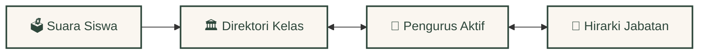
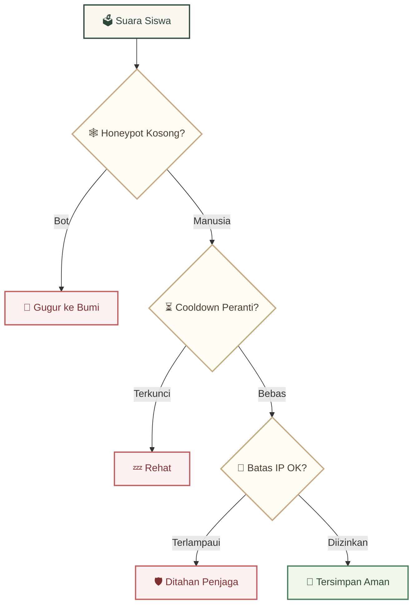

<div align="center">
  <br />
  <a href="https://github.com/Riz6ix/MPK">
    
  </a>
  <br />
  <br />

  <h1>🌲 Majelis Perwakilan Kelas 🍂</h1>
  <p>🏛️ <em>SMA Negeri 1 Malingping</em></p>

  <p>
    <strong>Tempat bernaung bagi tata kelola kesiswaan — estetika hutan yang hangat, performa rekayasa tinggi.</strong>
    <br />
    <em>Akar relasi yang saling berbisik · kueri sub-milidetik · perlindungan privasi berlapis</em>
  </p>

  <p>
    <a href="https://astro.build"></a>
    <a href="https://reactjs.org/"></a>
    <a href="https://supabase.com"></a>
    <a href="https://tailwindcss.com/"></a>
  </p>

  <p>
    <kbd> <a href="README.md">🌐 English</a> </kbd> • <kbd> <a href="README.id.md">🇮🇩 Bahasa Indonesia</a> </kbd>
  </p>
</div>

---

### ✦ 🍃 Estetika Forest Academy & Kertas Perkamen

*Didesain dengan psikologi tata letak untuk kenyamanan mata dan keterlibatan yang alami:*

- 🌿 **Kanvas Hutan Hangat** — Forest green pekat `#2e473b`, aksen emas amber, latar kertas perkamen
- 🍂 **Transisi Daun Mengalir** — Panel akordion dan dropdown yang terasa selembut desiran daun angin
- ✨ **Debu Emas Melayang** — Partikel piksel emas bergaya Minecraft yang mengapung tenang di latar belakang

---

### ✦ 🕸️ Jalinan Akar Relasi Kesiswaan

*Suara siswa mengalir melalui akar jalinan relasi — layaknya pohon data hutan yang hidup:*



- 🌱 **Sinkronisasi Akar Dinamis** — Aspirasi masuk otomatis dikelompokkan ke direktori kelas & terikat ke daftar perwakilan aktif secara real-time
- 📜 **Arsip Kuno Angkatan** — Riwayat alumni dan masa bakti terdahulu diarsipkan di simpul relasional terpisah

---

### ✦ ⚡ Meja Ek Tua & Alat Administratif Cerdas

- 📋 **Smart Quill Import** — Tempel daftar mentah; sistem otomatis mengurai kelas, komisi, gender & menyematkan avatar Dicebear
- 🔏 **Segel Kerajaan** — Batasan database mengunci peran `"Developer"` secara eksklusif hanya untuk **Rizky Setiawan** *(Angkatan Primordial)*
- 📎 **Memo Perkamen** — Catatan local-storage interaktif & widget kutipan kepemimpinan harian

---

### ✦ 🛡️ Penjaga Pohon Ek (Benteng Privasi & Keamanan)

*Setiap suara siswa melewati tiga gerbang penjaga sebelum mencapai akar jalinan:*



- 🕷️ **Jebakan Honeypot** — Kolom tersembunyi seperti jaring laba-laba yang menangkap bot spam secara senyap
- ⏱️ **Rate Limit Ramah** — 5 kiriman/jam per IP, cooldown 1 jam per perangkat; bersahabat dengan Wi-Fi sekolah
- 🧱 **Tembok Batu RLS** — PostgreSQL Row-Level Security aktif di seluruh 7 tabel utama

---

### 🚀 Menyalakan Lentera *(Panduan Setup Lokal)*

```bash
# Klon & pasang dependensi
git clone https://github.com/Riz6ix/MPK.git && cd MPK && npm install

# Isi kredensial ke .env
echo 'PUBLIC_SUPABASE_URL="https://proyek-anda.supabase.co"
PUBLIC_SUPABASE_ANON_KEY="kunci-anon-anda"' > .env

# Jalankan server lokal
npm run dev
```
> Buka [http://localhost:4321](http://localhost:4321) · membutuhkan kredensial proyek Supabase

---
<div align="center">
  <sub>Dikembangkan dengan dedikasi yang berkelanjutan oleh <strong>Angkatan Primordial</strong> · Seluruh Hak Dilindungi</sub>
</div>