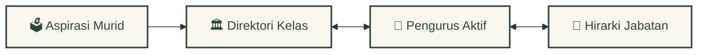
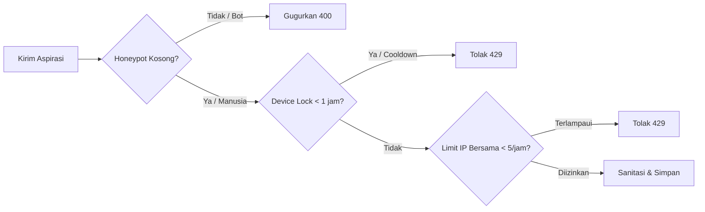

<div align="center">
  <br />
  <a href="https://github.com/Riz6ix/MPK">
    
  </a>
  <br />
  <br />

  <h1>🌲 Majelis Perwakilan Kelas 🍂</h1>
  <p>🏛️ <em>SMA Negeri 1 Malingping</em></p>

  <p>
    <strong>Portal tata kelola kesiswaan premium, cozy, dan berkinerja tinggi.</strong>
    <br />
    <em>Simpul relasional tersinkronisasi, respon kueri sub-milidetik, dan keamanan edge yang kokoh.</em>
  </p>

  <p>
    <a href="https://astro.build"></a>
    <a href="https://reactjs.org/"></a>
    <a href="https://supabase.com"></a>
    <a href="https://tailwindcss.com/"></a>
  </p>

  <p>
    <kbd> <a href="README.md">🌐 English</a> </kbd> • <kbd> <a href="README.id.md">🇮🇩 Bahasa Indonesia</a> </kbd>
  </p>
</div>

---

### ✦ Sentuhan Visual & Cozy

Didesain dengan psikologi tata letak untuk kenyamanan mata dan keaslian interaksi pengguna:
*   **Warm Forest Palette**: Kombinasi warna forest green pekat (`#2e473b`), aksen emas amber, dan latar kertas perkamen yang hangat.
*   **Transisi Mengalir**: Transisi panel akordion tanpa pergeseran tata letak (*zero-layout shift*) dan dropdown kustom popover HP.
*   **Minecraft Suspended Dust**: Partikel debu emas mengambang secara tenang dan bereaksi lembut mengikuti gerakan kursor mouse.

---

### ✦ Arsitektur Node Relasional (100% Sinkron)



*   **Sinkronisasi Relasional Utama**: Operasional inti disinkronisasikan secara real-time. Aspirasi yang masuk otomatis dikelompokkan berdasarkan direktori kelas utama, yang kemudian terikat langsung ke daftar perwakilan kelas aktif dan diurutkan secara hierarkis.
*   **Simpul Data Arsip**: Riwayat alumni dan masa bakti angkatan terdahulu diarsipkan secara aman pada simpul relasional terpisah.

---

### ✦ Panel Admin & Alat Administratif Pintar

*   **⚡ Smart Batch Import**: Salin-tempel list mentah pengurus/alumni. Sistem otomatis menebak kelas, komisi, gender, dan menyematkan avatar Dicebear.
*   **🛡️ Kunci Eksklusif Developer**: Jabatan `"Developer"` secara ketat hanya dapat disematkan kepada **Rizky Setiawan** (Angkatan Primordial).
*   **📋 Memo Tempel & Jurnal**: Catatan local storage interaktif dan kutipan kepemimpinan harian dinamis.

---

### ✦ Kerangka Kerja Keamanan Tingkat Elit



*   **Hybrid Rate Limiting**: Batasan ramah Wi-Fi sekolah (toleransi 5 pengiriman/jam per IP) berpadu dengan kunci peranti Local Storage 1 jam.
*   **Honeypot Trap**: Menggugurkan spam-bot secara otomatis jika mendeteksi kolom jebakan tersembunyi terisi.
*   **DDL Row-Level Security**: Proteksi penuh Postgres RLS aktif di seluruh tabel utama untuk memblokir bypass klien API ilegal.

---

### 🚀 Panduan Setup Pengembang lokal

Jalankan workspace lokal dengan fitur hot-reloading dalam waktu di bawah 60 detik:

```bash
# 1. Klon repositori dan pasang dependensi
git clone https://github.com/Riz6ix/MPK.git
cd MPK
npm install

# 2. Masukkan kredensial API ke file lokal .env
echo 'PUBLIC_SUPABASE_URL="https://proyek-anda.supabase.co"
PUBLIC_SUPABASE_ANON_KEY="kunci-anon-anda"' > .env

# 3. Jalankan server lokal
npm run dev
```
> Buka tautan [http://localhost:4321](http://localhost:4321) untuk mulai menjelajah.

---
<div align="center">
  <sub>Developed with sustainable dedication by <strong>Angkatan Primordial</strong>. All Rights Reserved.</sub>
</div>