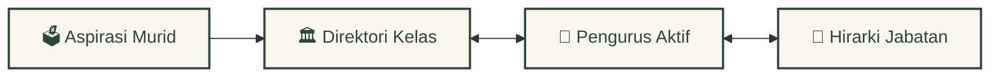
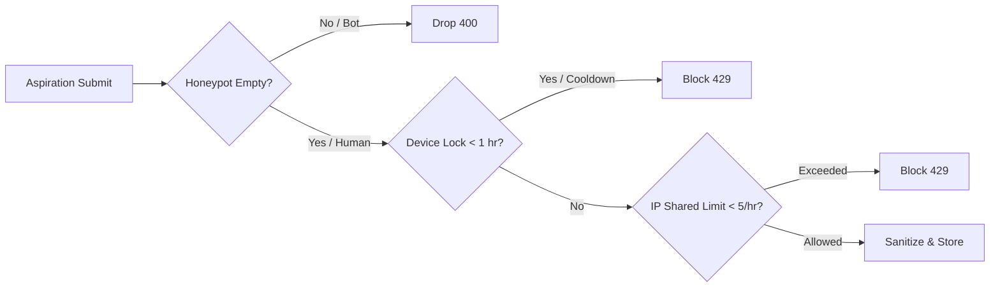

<div align="center">
  <br />
  <a href="https://github.com/Riz6ix/MPK">
    
  </a>
  <br />
  <br />

  <h1>🌲 Majelis Perwakilan Kelas 🍂</h1>
  <p>sma negeri 1 malingping</p>

  <p>
    <strong>A premium, cozy, and highly-engineered governance portal for student councils.</strong>
    <br />
    <em>Structured relational nodes, sub-millisecond query response, and robust edge security.</em>
  </p>

  <p>
    <a href="https://astro.build"></a>
    <a href="https://reactjs.org/"></a>
    <a href="https://supabase.com"></a>
    <a href="https://tailwindcss.com/"></a>
  </p>

  <p>
    <kbd> <a href="README.md">🌐 English</a> </kbd> • <kbd> <a href="README.id.md">🇮🇩 Bahasa Indonesia</a> </kbd>
  </p>
</div>

---

### ✦ Visual Cozy Aesthetics

Styled with visual psychology to maximize user comfort and engagement:
*   **Warm Forest Palette**: Deep forest green (`#2e473b`), soft amber highlights, and warm parchment layouts.
*   **Fluid Transitions**: Zero-lag accordion panels, smooth slide-ins, and flexible dropdowns.
*   **Minecraft Suspended Dust**: Melodic, low-frequency pixelated gold dust particles floating elegantly in the background.

---

### ✦ Relational Node Architecture (100% Synced)



*   **Primary Relational Sync**: Main operations are dynamically synchronized in real-time. Aspirations are automatically filed under master class directories, which in turn are bound to active representative rosters and sorted hierarchically.
*   **Archived Data Nodes**: Historical alumni rosters and purna tenure periods are securely cataloged in a separate relational node.

---

### ✦ Admin Panel & Smart Tools

*   **⚡ Smart Batch Import**: Copy-paste raw lists. System auto-guesses class, commission, gender, and generates initial-seeded avataars.
*   **🛡️ Exclusive Developer Lock**: Strict constraint hard-locks the **"Developer"** role exclusively to **Rizky Setiawan** (Angkatan Primordial).
*   **📋 interactive Memo & Jurnal**: Local storage scrap-notes and daily leadership quote widget.

---

### ✦ Robust Security Architecture



*   **Hybrid Rate Limiting**: Friendly to school-shared Wi-Fi (tolerating 5 posts/hour per IP) combined with a strict 1-hour Local Storage device cooldown.
*   **Honeypot Trap**: Silently drops automatic spam-bots that fill out hidden inputs.
*   **DDL Row-Level Security**: Full postgres RLS active on all 7 main tables, blocking direct client manipulation.

---

### 🚀 Developer Setup Guide

Ready to spin up the local hot-reloading environment in under 60 seconds:

```bash
# 1. Clone the repository and install dependencies
git clone https://github.com/Riz6ix/MPK.git
cd MPK
npm install

# 2. Add API connection variables to a local .env file
echo 'PUBLIC_SUPABASE_URL="https://your-project.supabase.co"
PUBLIC_SUPABASE_ANON_KEY="your-anon-key"' > .env

# 3. Fire up the development environment
npm run dev
```
> Open [http://localhost:4321](http://localhost:4321) to explore.

---
<div align="center">
  <sub>Developed with sustainable dedication by <strong>Angkatan Primordial</strong>. All Rights Reserved.</sub>
</div>