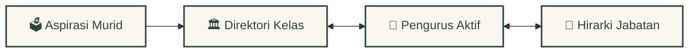

<div align="center">
  <br />
  <a href="https://github.com/Riz6ix/MPK">
    
  </a>
  <br />
  <br />

  <h1>🌲 Majelis Perwakilan Kelas 🍂</h1>
  <p>🏛️ <em>SMA Negeri 1 Malingping</em></p>

  <p>
    <strong>A sanctuary for student governance, crafted with warm forest aesthetics and high-performance engineering.</strong>
    <br />
    <em>Whispering relational roots, sub-millisecond query response, and sentinel-shielded privacy.</em>
  </p>

  <p>
    <a href="https://astro.build"></a>
    <a href="https://reactjs.org/"></a>
    <a href="https://supabase.com"></a>
    <a href="https://tailwindcss.com/"></a>
  </p>

  <p>
    <kbd> <a href="README.md">🌐 English</a> </kbd> • <kbd> <a href="README.id.md">🇮🇩 Bahasa Indonesia</a> </kbd>
  </p>
</div>

---

### ✦ 🍃 The Forest Academy & Parchment Aesthetics

Styled with visual psychology to maximize user comfort and engagement:
*   **Warm Forest Canvas**: Deep forest green (`#2e473b`), soft amber highlights, and warm parchment layouts that soothe the eyes.
*   **Fluid Leaf Transitions**: Zero-lag accordion panels, smooth slide-ins, and flexible dropdowns reminiscent of rustling leaves.
*   **Suspended Gold Dust**: Melodic, low-frequency pixelated gold dust particles floating elegantly in the background, drawing inspiration from Minecraft's warm atmospheric particles.

---

### ✦ 🕸️ The Whispering Roots (Relational Node Architecture)



*   **Dynamic Root Synchronization**: Just like interconnected tree roots, student aspirations are dynamically filed under master class directories, bound to active representative rosters, and sorted in real-time.
*   **The Ancient Archives**: Historical alumni rosters and purna tenure periods are securely cataloged in a separate relational node, preserving the school's heritage.

---

### ✦ ⚡ The Oak Desk (Smart Administrative Tools)

*   **Smart Quill Batch Import**: Drag or paste raw student rosters. The system automatically parses class directories, commissions, genders, and seeds elegant Dicebear avatars.
*   **The Royal Seal (Developer Lock)**: A strict database-level constraint hard-locks the **"Developer"** role exclusively to **Rizky Setiawan** (Angkatan Primordial).
*   **Parchment Memo & Chronicles**: Interactive local storage sticky-notes and a daily leadership quote widget to inspire daily duties.

---

### ✦ 🛡️ The Oak Sentinel (Privacy Shielding & Access Controls)

```mermaid
flowchart TD
    classDef default fill:#faf6f0,stroke:#2e473b,stroke-width:2px,color:#2e473b;
    classDef safe fill:#eef7e8,stroke:#4a7c59,stroke-width:2px,color:#2e473b;
    classDef block fill:#fdf0f0,stroke:#c05c5c,stroke-width:2px,color:#803030;
    classDef dec fill:#fffdf3,stroke:#c5a880,stroke-width:2px,color:#4a3b2f;

    A[🗳️ Student Voice Submit] --> B{🕸️ Honeypot Empty?}:::dec
    
    B -- "No (Spam Bot)" --> C[🍂 Dropped to Earth]:::block
    B -- "Yes (Human)" --> D{⏳ Device Cooldown < 1hr?}:::dec
    
    D -- "Yes (Locked)" --> E[💤 Cozy Rest]:::block
    D -- "No (Allowed)" --> F{🌲 IP Limit < 5/hr?}:::dec
    
    F -- "Exceeded" --> G[🛡️ Sentinel Hold]:::block
    F -- "Allowed" --> H[🍃 Whispering Roots (Stored)]:::safe
```

*   **Sentinel Rate Limiting**: Friendly to school-shared Wi-Fi (allowing 5 posts/hour per IP) paired with a strict 1-hour Local Storage device cooldown to deter spam.
*   **Spam Honeypot Trap**: Invisible form fields that act as spiderwebs, silently dropping automatic spam-bots that dare to fill them.
*   **Stone Wall Row-Level Security**: Full postgres RLS active on all 7 main tables, blocking direct API manipulation and protecting student voice.

---

### 🚀 Lighting the Lanterns (Developer Setup Guide)

Ignite your local hot-reloading workspace in under 60 seconds:

```bash
# 1. Clone the repository and install dependencies
git clone https://github.com/Riz6ix/MPK.git
cd MPK
npm install

# 2. Add API connection variables to a local .env file
echo 'PUBLIC_SUPABASE_URL="https://your-project.supabase.co"
PUBLIC_SUPABASE_ANON_KEY="your-anon-key"' > .env

# 3. Fire up the development environment
npm run dev
```
> Open [http://localhost:4321](http://localhost:4321) to explore.

---
<div align="center">
  <sub>Developed with sustainable dedication by <strong>Angkatan Primordial</strong>. All Rights Reserved.</sub>
</div>