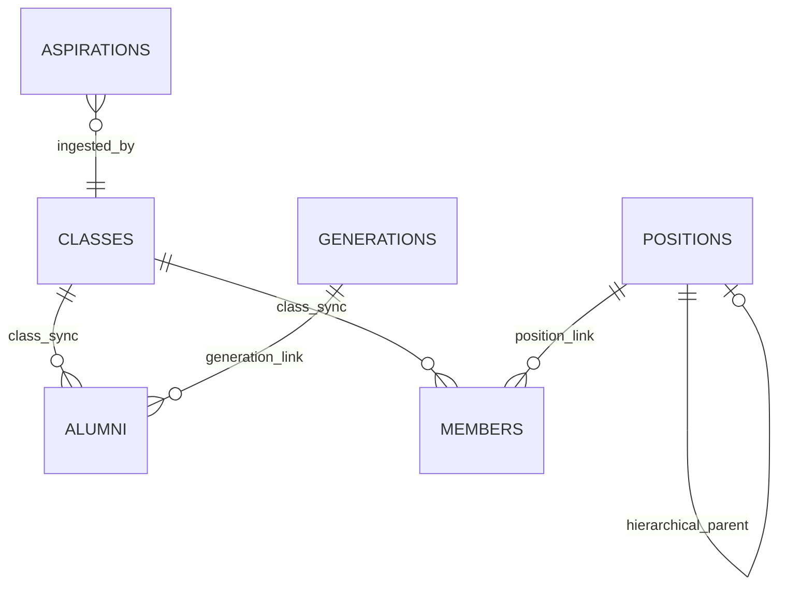
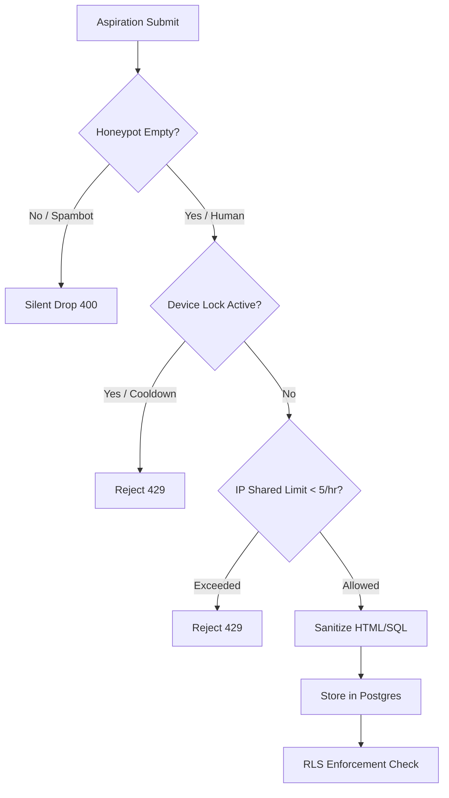

<div align="center">
  <br />
  <a href="https://github.com/Riz6ix/MPK">
    
  </a>
  <br />
  <br />

  <h1 align="center">🌲 Website Majelis Perwakilan Kelas SMA 🍂</h1>

  <p align="center">
    <strong>A premium, cozy, and highly-engineered governance portal for SMAN 1 Malingping.</strong>
    <br />
    <em>Crafted with pixel-perfect warm aesthetics, robust relational node structures, and elite security standards.</em>
    <br />
    <br />
    <a href="https://astro.build"></a>
    <a href="https://reactjs.org/"></a>
    <a href="https://supabase.com"></a>
    <a href="https://tailwindcss.com/"></a>
  </p>
</div>

<p align="center">
  <kbd> <a href="README.md">🌐 English</a> </kbd> • <kbd> <a href="README.id.md">🇮🇩 Bahasa Indonesia</a> </kbd>
</p>

---

## ✦ The Vision & Cozy Magic

Student organizations often struggle with scattered tools—disjointed spreadsheets, dusty suggestion boxes, and easily broken information channels. This system re-engineers the **Majelis Perwakilan Kelas (MPK)** governance into a centralized, beautifully integrated digital home.

### 🍃 Premium Aesthetics
- **Harmonious Palette**: Styled around a cozy forest-green theme (`#2e473b`, HSL tailored tones) featuring warm cream backdrops and soft card gradients.
- **Organic Animations**: Built-in micro-animations for minimized/expanded states, accordion panels, and tables to provide a flowing, unified feeling without visual lag or layout shift.
- **Minecraft Cozy Particle Dust**: Subtle particle effects that react elegantly, creating a calm, high-end "nature-office" vibe.
- **No Browser Defaults**: Clean typography using custom Google Fonts (Outfit, Inter) and custom modern form elements.

---

## ✦ Spiderweb Node Architecture

The application is built on a **fully synchronized relational model**. Each data point acts as an interconnected node, updating in real-time to avoid manual desynchronization.



- **Classes (`classes`)**: Acts as the master directory of school classes. Both active members and alumni are relationally bound to this lookup, changing manual inputs into strict, error-proof dropdown structures.
- **Positions Tree (`positions`)**: A self-referential hierarchic tree allowing dynamic configuration of who reports to whom.
- **Generations (`generations`)**: Historical periods mapping active tenures to specific graduation years.

---

## ✦ Administrative Smart Tools

### ⚡ Smart Batch Import ("Tempel List")
Administrators can copy-paste unstructured raw text lists of students directly into the panel.
1. **Auto-Guess Parsing**: Automatically extracts names, guesses grades, school commissions, and gender.
2. **Seed-Based Avatar Generation**: Instantly maps new imports with a distinct, beautiful initials-seeded DiceBear avatar.
3. **Bulk Insertion**: Compiles payloads and safely batches them in a single query, dramatically shortening manual typing.

### 🛡️ Exclusive Developer Title Policy
To honor the platform's origin, the role of **"Developer"** is hard-locked at both code and application-runtime levels.
- **Strict Validation**: Attempts to insert or update any record with the title `"Developer"` will trigger a validation error unless the name exactly matches `"Rizky Setiawan"` (Angkatan Primordial).

---

## ✦ Elite Security Framework

Securing a student-run administrative site requires a practical, bulletproof framework that prevents local griefing while accommodating school constraints.



### 1. Hybrid Rate Limiting (School Wi-Fi Friendly)
Pure IP-based rate limiting of 1 hour would block the entire school when everyone is sharing the same school Wi-Fi. We implemented a **Hybrid Security Pipeline**:
*   **Local Device Lock**: Enforces a strict 1-hour cooldown via encrypted Local Storage on the user's browser.
*   **Relaxed Server IP Window**: The server permits up to `5 submissions per hour` per IP, protecting the endpoint from API floods while remaining friendly to shared classroom networks.

### 2. Spam & Injection Defenses
*   **Honeypot Traps**: Invisible input fields that trap automated bots. Submissions with honeypots filled are silently dropped.
*   **Strict Sanitization**: Every textual input undergoes strict Unicode validation and HTML entity escaping to neutralize XSS vectors.

### 3. Absolute PostgreSQL Row-Level Security (RLS)
The database enforces strict RLS policies on all critical tables to prevent malicious API clients from accessing or tampering with raw tables.

| Table | Public Access | Authenticated (Admin) Access | RLS Policy Rule (SQL) |
| :--- | :--- | :--- | :--- |
| `classes` | SELECT | ALL (Insert, Update, Delete) | `auth.role() = 'authenticated'` |
| `members` | SELECT | ALL (Insert, Update, Delete) | `auth.role() = 'authenticated'` |
| `alumni` | SELECT | ALL (Insert, Update, Delete) | `auth.role() = 'authenticated'` |
| `positions` | SELECT | ALL (Insert, Update, Delete) | `auth.role() = 'authenticated'` |
| `generations`| SELECT | ALL (Insert, Update, Delete) | `auth.role() = 'authenticated'` |
| `memos` | SELECT | ALL (Insert, Update, Delete) | `auth.role() = 'authenticated'` |
| `aspirations`| SELECT, INSERT| ALL (Update, Delete) | Public `INSERT` / Admin `ALL` |

---

## ✦ Developer Setup Guide

Follow this guide to spin up the high-performance local workspace.

### 1. System Requirements
- **Node.js**: `v22.12.0` or higher
- **Package Manager**: `npm` (v10+)
- **Database**: PostgreSQL (Supabase active project)

### 2. Installation
Clone the repository and install the production dependencies:
```bash
git clone https://github.com/Riz6ix/MPK.git
cd MPK
npm install
```

### 3. Environment Variables
Create a `.env` file in the project root to securely inject the API connection strings:
```env
# Supabase Public Keys
PUBLIC_SUPABASE_URL="https://ujmpdahlbalttdtkzyax.supabase.co"
PUBLIC_SUPABASE_ANON_KEY="your-anon-key-here"

# Webhooks (Optional)
DISCORD_WEBHOOK_URL="https://discord.com/api/webhooks/..."
```

### 4. Database Setup
Apply the migrations stored in `/supabase/migrations` to align your schema structure:
1. `20260526000000_create_classes_table.sql` - Bootstraps class structures and seed models.
2. `20260526000001_secure_other_tables.sql` - Establishes strict PostgreSQL RLS policies and triggers.

### 5. Running the Dev Server
Fire up the local hot-reloading development server:
```bash
npm run dev
```
The site will run at [http://localhost:4321](http://localhost:4321).

---

## ✦ Deployment Infrastructure

This website is configured for **Server-Side Rendering (SSR)** on **Netlify** using `@astrojs/netlify`.
*   **CD Pipeline**: Every push to the `main` branch on GitHub triggers an automated build pipeline on Netlify.
*   **Build Script**: `npm run build` generates serverless functions and optimized static pages.
*   **Cache Management**: Fast server-side asset serving with sub-second Response Times.

---
<div align="center">
  <sub>Developed with sustainable dedication by <strong>Angkatan Primordial</strong>. All Rights Reserved.</sub>
</div>