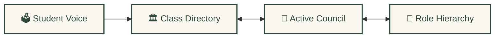
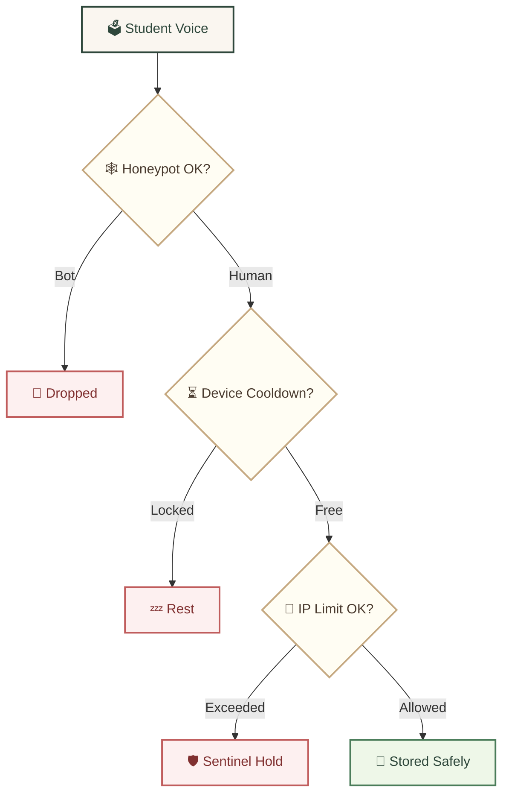

<div align="center">
  <br />
  <a href="https://github.com/Riz6ix/MPK">
    
  </a>
  <br />
  <br />

  <h1>🌲 Majelis Perwakilan Kelas 🍂</h1>
  <p>🏛️ <em>SMA Negeri 1 Malingping</em></p>

  <p>
    <strong>A sanctuary for student governance — warm forest aesthetics, high-performance engineering.</strong>
    <br />
    <em>Whispering relational roots · sub-millisecond queries · sentinel-shielded privacy</em>
  </p>

  <p>
    <a href="https://astro.build"></a>
    <a href="https://reactjs.org/"></a>
    <a href="https://supabase.com"></a>
    <a href="https://tailwindcss.com/"></a>
  </p>

  <p>
    <kbd> <a href="README.md">🌐 English</a> </kbd> • <kbd> <a href="README.id.md">🇮🇩 Bahasa Indonesia</a> </kbd>
  </p>
</div>

---

### ✦ 🍃 The Forest Academy & Parchment Aesthetics

*Crafted with visual psychology for warmth, calm, and natural engagement:*

- 🌿 **Warm Forest Canvas** — Deep forest green `#2e473b`, soft amber accents, warm parchment backdrops
- 🍂 **Fluid Leaf Transitions** — Smooth accordion panels and dropdowns that feel like rustling leaves
- ✨ **Suspended Gold Dust** — Pixelated Minecraft-inspired gold particles drifting gently in the background

---

### ✦ 🕸️ The Whispering Roots (Relational Architecture)

*Student voices flow through interconnected roots — like a living forest data tree:*



- 🌱 **Living Root Sync** — Aspirations auto-filed under class directories, bound to active rosters in real-time
- 📜 **Ancient Archives** — Alumni and purna-tenure records preserved in a dedicated relational node

---

### ✦ ⚡ The Oak Desk (Smart Admin Tools)

- 📋 **Smart Quill Import** — Paste raw rosters; system auto-parses class, commission, gender & seeds Dicebear avatars
- 🔏 **Royal Seal Lock** — Database-level constraint pins **"Developer"** exclusively to **Rizky Setiawan** *(Angkatan Primordial)*
- 📎 **Parchment Memos** — Local-storage sticky notes & a daily leadership quote widget

---

### ✦ 🛡️ The Oak Sentinel (Privacy & Access Shield)

*Every student voice passes through three guardian gates before reaching the roots:*



- 🕷️ **Honeypot Spiderweb** — Hidden fields silently catch and drop spam bots
- ⏱️ **Friendly Rate Limit** — 5 posts/hour per IP, 1-hour device cooldown; gentle on shared school Wi-Fi
- 🧱 **Stone Wall RLS** — Full Postgres Row-Level Security on all 7 core tables

---

### 🚀 Lighting the Lanterns *(Developer Setup)*

```bash
# Clone & install
git clone https://github.com/Riz6ix/MPK.git && cd MPK && npm install

# Add credentials to .env
echo 'PUBLIC_SUPABASE_URL="https://your-project.supabase.co"
PUBLIC_SUPABASE_ANON_KEY="your-anon-key"' > .env

# Start local dev server
npm run dev
```
> Open [http://localhost:4321](http://localhost:4321) · requires Supabase project credentials

---
<div align="center">
  <sub>Developed with sustainable dedication by <strong>Angkatan Primordial</strong> · All Rights Reserved</sub>
</div>