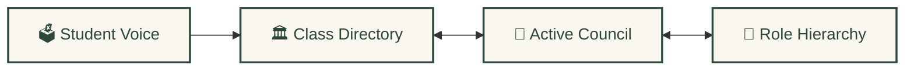
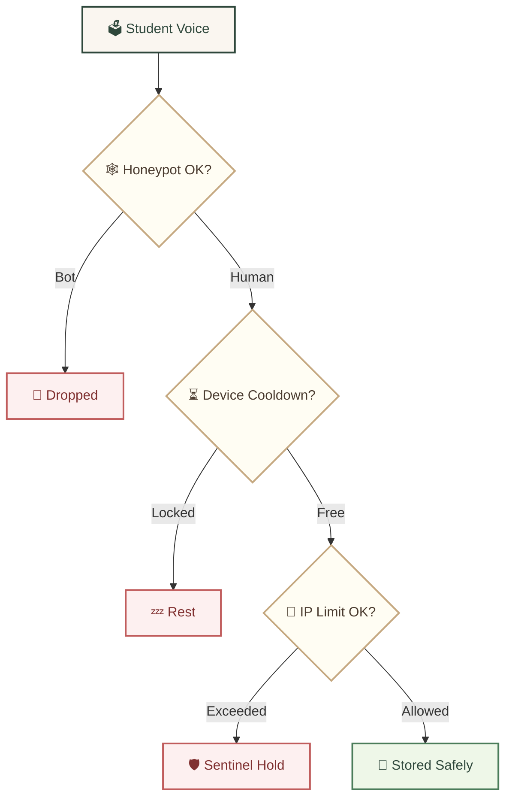

<div align="center">
  <br />
  <a href="https://github.com/Riz6ix/MPK">
    
  </a>
  <br />
  <br />

  <h1>🍂 MAJELIS PERWAKILAN KELAS 🍃</h1>
  <p><sub>SMA Negeri 1 Malingping</sub></p>

  <p>
    <strong>A simple, cozy, and highly secure student governance portal.</strong>
    <br />
    <em>Friendly user experience · optimized database queries · tight privacy protection</em>
  </p>

  <p>
    <a href="https://astro.build"></a>
    <a href="https://reactjs.org/"></a>
    <a href="https://supabase.com"></a>
    <a href="https://tailwindcss.com/"></a>
  </p>

  <p>
    <kbd> <a href="README.md">🌐 English</a> </kbd> • <kbd> <a href="README.id.md">🇮🇩 Bahasa Indonesia</a> </kbd>
  </p>
</div>

---

### ✦ 🍃 Cozy & Warm UI/UX

*Designed with a welcoming, natural interface for school-friendly engagement:*

- 🌿 **Warm Colors** — Soft forest greens, warm amber accents, and clean parchment backdrops
- 🍂 **Smooth Transitions** — Natural animations on accordion panels and dropdowns for a cozy feel
- ✨ **Floating Gold Dust** — Subtle Minecraft-inspired gold dust drifting gently in the background

---

### ✦ 🕸️ The Roots (Relational Data Flow)

*All student data flows seamlessly through interconnected database relations:*



- 🌱 **Automatic Sorting** — Aspirations are auto-sorted under classes and linked to active rosters
- 📜 **Alumni Directory** — Senior and purna-tenure records are automatically preserved in dedicated tables

---

### ✦ ⚡ Smart Admin Desk

*Functional tools built to simplify student council operations:*

- 📋 **Smart List Import** — Simply paste raw rosters; the system auto-parses name, class, commission, gender, and seeds avatars
- 🔏 **Developer Constraint** — Built-in database rule locks the **"Developer"** role exclusively to **Rizky Setiawan**
- 📎 **Cozy Notes & Quotes** — Interactive board for sticky notes and a wisdom quote generator

---

### ✦ 🛡️ Security & Privacy Shield

*Ensuring student voices are sent safely with multi-layered backend protection:*



- 🕷️ **Honeypot Trap** — Hidden input fields capture and discard spam bots silently
- ⏱️ **Rate Limiting** — Smart post-per-hour limit and device cooldown to prevent database flooding
- 🧱 **PostgreSQL RLS** — Secure Row-Level Security active on all core database tables

---

### 🚀 Developer Setup

```bash
# Clone and install dependencies
git clone https://github.com/Riz6ix/MPK.git && cd MPK && npm install

# Add your credentials to .env
echo 'PUBLIC_SUPABASE_URL="https://your-project.supabase.co"
PUBLIC_SUPABASE_ANON_KEY="your-anon-key"' > .env

# Run local dev server
npm run dev
```
> Open [http://localhost:4321](http://localhost:4321) · requires Supabase credentials

---
<div align="center">
  <sub>Developed with dedication by <strong>Angkatan Primordial</strong> · SMAN 1 Malingping</sub>
</div>